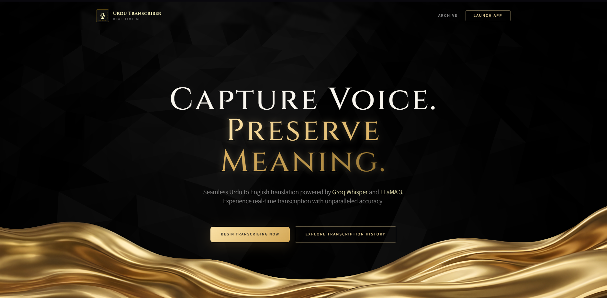

# **Fast Lecture Transcription Service**

A mobile-responsive web application that records live audio from the user's microphone, detects speech pauses, sends audio chunks to a backend, and returns English subtitles translated from Urdu using Groq's Whisper + LLaMA workflow.

**🚀 [Live Demo](https://fast-lecture-archive.vercel.app)**



## Features

✨ **Real-time Translation**
- Records audio from microphone
- Automatically detects speech pauses (0.8-1.2 seconds of silence)
- Sends audio chunks to backend for translation
- Displays English subtitles in real-time

🎯 **Smart Silence Detection**
- Uses Web Audio API to monitor microphone volume (RMS)
- Filters background noise and ambient sound
- Requires minimum peak volume to accept audio
- Prevents false triggers

📱 **Mobile-First Design**
- Fully responsive UI with Tailwind CSS
- Works on mobile browsers
- Touch-optimized controls

🚀 **High Performance**
- Frontend handles audio recording and silence detection (saves bandwidth)
- Backend processes translations via Groq Whisper API
- Seamless chunk handoff (no words lost during upload)

## Tech Stack

- **Backend**: Python FastAPI, Groq API (Whisper Large V3)
- **Frontend**: HTML5, JavaScript (Vanilla), Tailwind CSS
- **Audio**: Web Audio API, MediaRecorder API
- **Deployment**: Render, Docker-ready

##  Setup

### Prerequisites
- Python 3.9+
- A Groq API key (free at [console.groq.com](https://console.groq.com))
- Git

### Local Development

1. **Clone the repository**
   ```bash
   git clone https://github.com/Ibrahim-Kiani/FAST-Lecture-Transcription-Service.git
   cd urdu-transcription
   ```

2. **Create environment file**
   ```bash
   cp .env.example .env
   # Edit .env and add your GROQ_API_KEY
   ```

3. **Install dependencies**
   ```bash
   pip install -r requirements.txt
   ```

3. Run locally:
```sh
python main.py
# Open http://localhost:8000
```

## Configuration

- Model / config constants are in [app/config.py](app/config.py) (e.g. [`TITLE_MODEL`](app/config.py)).
- Frontend configuration (silence thresholds, intervals, UI) is in [templates/index.html](templates/index.html).

## API Endpoints (important)

- POST /translate — translates an audio chunk and (optionally) saves to DB when `lecture_id` + `chunk_number` provided. Implementation: [app/routes/translate.py](app/routes/translate.py). Response model: [`TranslationResponse`](app/models.py).
- POST /lecture/create — create a new lecture session (returns [`StartRecordingResponse`](app/models.py)). See [app/routes/lectures.py](app/routes/lectures.py).
- POST /lecture/end — end session, assemble full transcript and generate a concise title using LLaMA. Request model: [`EndRecordingRequest`](app/models.py). See implementation: [app/routes/lectures.py](app/routes/lectures.py).
- GET /lecture/{id} — retrieve lecture + chunks (history UI uses this). See [app/routes/lectures.py](app/routes/lectures.py).
- POST /lecture/{id}/enhance — optional transcript enhancement using OpenRouter (`enhance_transcript` in [app/services/transcription.py](app/services/transcription.py)).
- GET /health — quick health check for Groq, Supabase, OpenRouter: [app/routes/health.py](app/routes/health.py).

## Supabase (optional but recommended)
- Setup guide: [SUPABASE_SETUP.md](SUPABASE_SETUP.md)
- DB schema: [database_schema.sql](database_schema.sql)
- The backend will save per-chunk rows to `transcriptions` and session metadata to `lectures`.

## Frontend
- Live recording UI: [templates/index.html](templates/index.html)
- Lecture history UI: [templates/history.html](templates/history.html)

## Deployment
- Render: uses `render.yaml` (start: `uvicorn main:app --host 0.0.0.0 --port $PORT`)
- Vercel: Serverless entrypoint in [api/index.py](api/index.py) and static UI shipped from templates.

## Troubleshooting
- 401 from API → verify `GROQ_API_KEY` in `.env` (see [app/clients.py](app/clients.py))
- "Database not configured" → ensure `SUPABASE_URL` + `SUPABASE_KEY` are set and `database_schema.sql` applied
- Check /health for quick diagnostics: [app/routes/health.py](app/routes/health.py)

## Files to inspect
- Backend router & logic: [app/routes/translate.py](app/routes/translate.py), [app/routes/lectures.py](app/routes/lectures.py)
- Models: [app/models.py](app/models.py)
- Transcript enhancement: [app/services/transcription.py](app/services/transcription.py)
- App entrypoint: [main.py](main.py), FastAPI assembly: [app/app.py](app/app.py)

